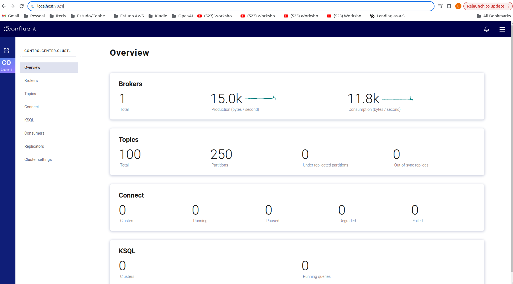
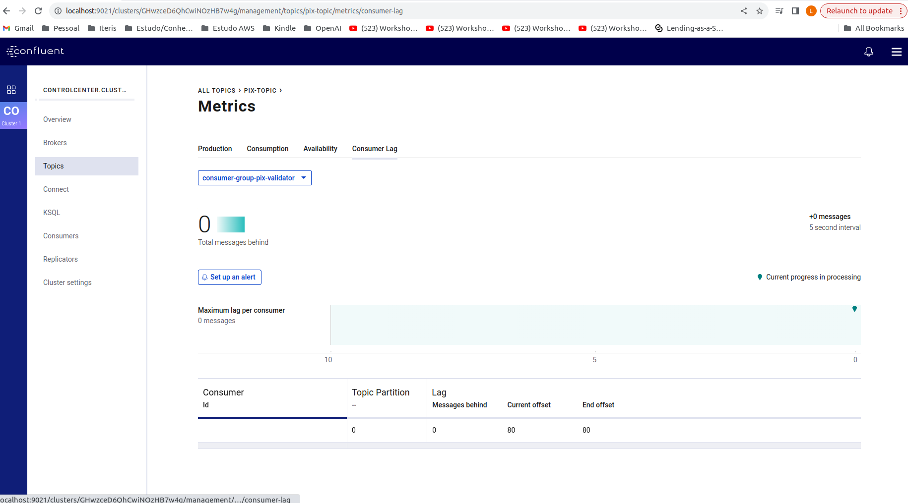

# spring-kafka
Projeto de Exemplo utilizando Spring e Kakfa para diferentes tipos de uso.

## Pré-Requisitos

- Kafka Local: [docker-compose.yml](https://github.com/ice-lfernandes/docker-images/blob/master/kafka/docker-compose.yml)
  - ```docker-compose up -d```
- Postgres Local: [docker-compose.yml](https://github.com/ice-lfernandes/docker-postgres/blob/master/docker-compose.yml)
  - ```docker-compose up -d```

## Ferramentas de Apoio
- Confluent Local: 
  - ```http://localhost:9021```
  

## Exemplos de Caso de Uso

### Simple-Kafka-Consumer-Producer
  Simples implementação de um produtor e consumidor de mensagens utilizando o Kafka com eventos formatos Json

  Projeto implementa uma simples arquitetura de transação de PIX, aonde existe um produtor e consumidor.
  - Produtor:
    - Possui Endpoints para criação intenções de transações PIX e permite criação de novas chaves PIX
    - Após criação de intenção de PIX, é produzido um evento para ser consumido por validador que irá processar transação
  - Consumer:
    - Possui listener de tópico que ouve evento de criação de intenção pix e realiza processamento do mesmo
  
  <strong>Antes de Iniciar</strong>
  
    - Criar Chaves pix para realizar transações no projeto <strong>Pix-Producer</strong>
    - Request Exemplo:
      ```
        {
           "value" : "123"
        }
      ```
  <strong>Como usar?</strong>
  - Criação de intenção de transação Pix:
  - Request Exemplo:
      ```
        {
          "originKey" : "123",
          "destinationKey": "456",
          "amount": 500
        }
      ```
  <strong>Resultado Esperado</strong>
  - Casos de Sucesso:
    - Http Status: 202 ACCEPTED
    - Pix Processado:
      
    - Monitoria de Eventos Confluent
    

### Kafka Stream
  Implementação de uso de Kafka Stream em cenários:
  - Fazer um somatório de total de transações pix por chave de origem
  - Envio de pix para tópico de fraudes em cenário de pix que passam de R$ 1000,00

   <strong>Antes de Iniciar</strong>
  
    - Criar Chaves pix para realizar transações no projeto <strong>Pix-Producer</strong>
    - Request Exemplo:
      ```
        {
           "value" : "123"
        }
      ```
  <strong>Como usar?</strong>
  - Criação de intenção de transação Pix:
  - Request Exemplo:
      ```
        {
          "originKey" : "123",
          "destinationKey": "456",
          "amount": 500
        }
      ```
  <strong>Resultado Esperado</strong>
  
  
  
  


